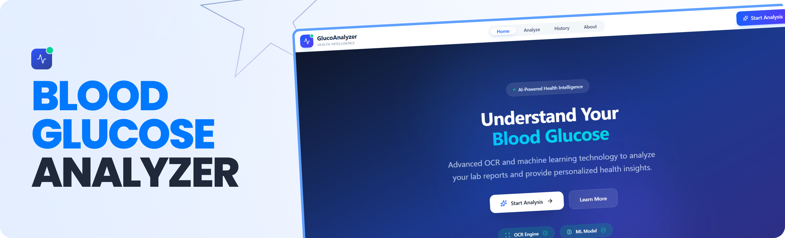
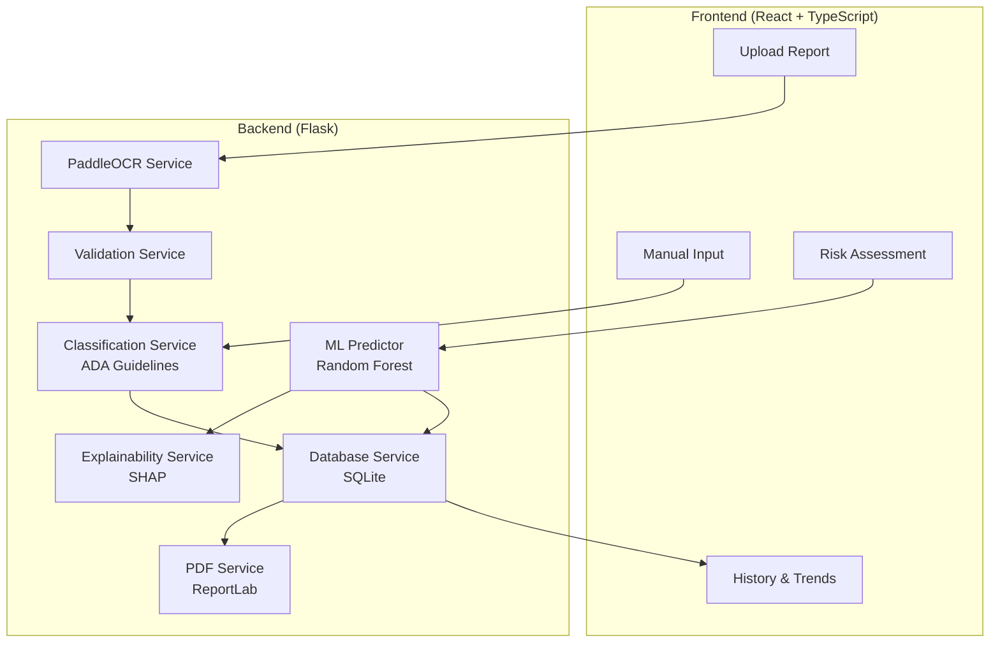

<p align="center">
  
</p>

<p align="center">
  
  
  
  
  
  
</p>
<div>
 <h3 align="center">Blood Glucose Analyzer - AI-Powered Diabetes Risk Detection & Report Analysis</h3>

> AI-powered glucose report analysis and diabetes risk prediction built to improve healthcare accessibility in Nepal.
</div>

## 📋 Table of Contents

- [Features](#features)
- [Tech Stack](#tech-stack)
- [Architecture](#architecture)
- [Quick Start](#quick-start)
- [API Reference](#api-reference)
- [ML Model](#ml-model)
- [Deployment](#deployment)
- [Project Structure](#project-structure)
- [Ethics & Limitations](#ethical-considerations--limitations)
- [References](#references)
- [Disclaimer](#disclaimer)

## Features

👉 **OCR Lab Report Analysis**: Upload a lab report image and let PaddleOCR extract glucose values automatically.

👉 **Manual Input Classification**: Enter glucose values for instant ADA guideline-based classification

👉 **ML Risk Prediction**: Predict diabetes risk with a Random Forest model trained on the PIMA dataset

👉 **SHAP Explainability**: See which health factors drive your risk score, with plain-English summaries

👉 **Confidence Intervals**: Understand prediction uncertainty from Random Forest tree variance

👉 **History & Trends**: Save results, track glucose values over time with trend charts

👉 **PDF Reports**: Download formatted PDF reports for any saved analysis

👉 **Interactive API Docs**: Swagger UI at `/api/docs` for all 18 endpoints

## Tech Stack

| Layer | Technology |
|-------|-----------|
| Frontend | React 19, TypeScript 5.9, Vite 7, Tailwind CSS 4 |
| Charts | Recharts |
| Icons | Lucide React |
| HTTP | Axios |
| Backend | Flask, Flask-CORS, Flasgger |
| OCR | PaddleOCR (PaddlePaddle) |
| ML | scikit-learn, SHAP, pandas, NumPy, joblib |
| PDF | ReportLab |
| Database | SQLite |

## Architecture



## Quick Start

### Prerequisites

- Python 3.11+
- Node.js 18+

### Backend

```bash
cd backend
python -m venv venv
venv\Scripts\activate        # Windows
# source venv/bin/activate   # macOS/Linux
pip install -r requirements.txt
python app.py
```

The API starts at `http://localhost:5000`. Swagger docs at `http://localhost:5000/api/docs/`.

### Frontend

```bash
cd frontend
npm install
npm run dev
```

Opens at `http://localhost:5173`.

### Environment Variables

Copy the example files and adjust as needed:

```bash
cp backend/.env.example backend/.env
cp frontend/.env.example frontend/.env
```

| Variable | File | Default | Description |
|----------|------|---------|-------------|
| `FLASK_ENV` | backend/.env | `development` | Flask environment |
| `CORS_ORIGINS` | backend/.env | `*` | Comma-separated allowed origins |
| `VITE_API_URL` | frontend/.env | `http://localhost:5000` | Backend API URL |

## API Reference

All endpoints are documented with request/response schemas in the [Swagger UI](http://localhost:5000/api/docs/).

| Method | Endpoint | Tag | Description |
|--------|----------|-----|-------------|
| GET | `/` | Health | Basic health check |
| GET | `/api/health` | Health | Detailed service status |
| POST | `/api/upload` | Analysis | Upload a lab report image |
| POST | `/api/analyze` | Analysis | OCR + validate + classify |
| POST | `/api/manual-input` | Classification | Classify a single glucose value |
| POST | `/api/manual-input/batch` | Classification | Classify multiple values |
| POST | `/api/predict-risk` | Risk Prediction | ML diabetes risk prediction |
| POST | `/api/predict-risk/explain` | Risk Prediction | Prediction + SHAP explanation |
| GET | `/api/predict-risk/requirements` | Risk Prediction | Input field requirements |
| GET | `/api/predict-risk/thresholds` | Risk Prediction | Risk category thresholds |
| GET | `/api/predict-risk/feature-importance` | Risk Prediction | Model feature importance |
| GET | `/api/thresholds` | Reference | ADA classification thresholds |
| GET | `/api/supported-tests` | Reference | Supported glucose test types |
| POST | `/api/save-analysis` | History | Save analysis to database |
| GET | `/api/history` | History | Paginated analysis history |
| GET | `/api/history/:id` | History | Single analysis detail |
| DELETE | `/api/history/:id` | History | Delete an analysis |
| GET | `/api/trends` | History | Glucose trend data |
| GET | `/api/report/pdf/:id` | Reports | Download PDF report |

## ML Model

| Metric | Score |
|--------|-------|
| Accuracy | ~74% |
| ROC-AUC | ~80% |
| Dataset | PIMA Indians Diabetes (768 samples, 8 features) |
| Algorithm | Random Forest (100 trees) |
| Explainability | SHAP TreeExplainer |

> Accuracy of 65–75% is expected for this dataset. Values above 85% would indicate overfitting. This is a risk assessment tool, not a diagnostic system.

See the [Technical Case Study](docs/CASE_STUDY.md) for detailed analysis of model selection, training pipeline, and architecture decisions.

## Deployment

### Backend (Railway / Render)

A Dockerfile is provided at `backend/Dockerfile`:

```bash
docker build -t bga-backend ./backend
docker run -p 5000:5000 bga-backend
```

> **Note:** PaddleOCR adds ~500MB+ to the image. On free-tier hosts, you can remove `paddlepaddle` and `paddleocr` from `requirements.txt` — manual input and risk prediction still work without OCR.

### Frontend (Vercel)

The frontend includes a `vercel.json` with SPA rewrite rules. Deploy by connecting the `frontend/` directory to Vercel:

1. Set the **Root Directory** to `frontend`
2. Set **Build Command** to `npm run build`
3. Set **Output Directory** to `dist`
4. Add `VITE_API_URL` environment variable pointing to your deployed backend


## Project Structure

```
blood-glucose-analyzer/
├── backend/
│   ├── app.py                          # Flask app with Swagger docs
│   ├── config.py                       # Configuration (CORS, uploads)
│   ├── requirements.txt
│   ├── Dockerfile
│   ├── .env.example
│   ├── services/
│   │   ├── ocr_service.py              # PaddleOCR text extraction
│   │   ├── classification_service.py   # ADA-based glucose classification
│   │   ├── validation_service.py       # Report type validation
│   │   ├── ml_predictor.py             # Random Forest risk prediction
│   │   ├── explainability_service.py   # SHAP explanations
│   │   ├── database_service.py         # SQLite history storage
│   │   └── pdf_service.py              # PDF report generation
│   ├── models/                         # Trained model artifacts (.pkl)
│   └── uploads/                        # Temporary file storage
│
├── frontend/
│   ├── src/
│   │   ├── components/
│   │   │   ├── FileUpload.tsx
│   │   │   ├── ManualInputForm.tsx
│   │   │   ├── RiskAssessmentForm.tsx
│   │   │   ├── ResultsDisplay.tsx
│   │   │   ├── GaugeChart.tsx
│   │   │   ├── RiskAssessment.tsx
│   │   │   ├── ShapExplanation.tsx
│   │   │   ├── ConfidenceDisplay.tsx
│   │   │   ├── Header.tsx
│   │   │   ├── Footer.tsx
│   │   │   └── Disclaimer.tsx
│   │   ├── pages/
│   │   │   ├── Home.tsx
│   │   │   ├── Analyze.tsx
│   │   │   ├── History.tsx
│   │   │   └── About.tsx
│   │   ├── services/api.ts
│   │   └── types/index.ts
│   ├── vercel.json
│   ├── .env.example
│   └── package.json
│
├── docs/
│   └── images/
│   └── CASE_STUDY.md
│
├── ml_training/
│   ├── train_model.py
│   ├── pima_diabetes.csv
│   └── training_results.txt
│
└── README.md
```

<details>
<summary><strong>Supported Report Types & ADA Thresholds</strong></summary>

### Supported Report Types

| Report Type | Full Name | What It Measures | Unit |
|-------------|-----------|------------------|------|
| FBS | Fasting Blood Sugar | Glucose after 8–12 hour fast | mg/dL |
| HbA1c | Glycated Hemoglobin | Average glucose over 2–3 months | % |
| PPBS | Post-Prandial Blood Sugar | Glucose 2 hours after meal | mg/dL |
| RBS | Random Blood Sugar | Glucose at any random time | mg/dL |
| OGTT | Oral Glucose Tolerance Test | Glucose processing over time | mg/dL |

### Classification Thresholds (ADA Guidelines)

**Fasting Blood Sugar (mg/dL)**
| Classification | Range |
|----------------|-------|
| Normal | < 100 |
| Prediabetes | 100–125 |
| Diabetes | >= 126 |

**HbA1c (%)**
| Classification | Range |
|----------------|-------|
| Normal | < 5.7 |
| Prediabetes | 5.7–6.4 |
| Diabetes | >= 6.5 |

**Post-Prandial Blood Sugar (mg/dL)**
| Classification | Range |
|----------------|-------|
| Normal | < 140 |
| Prediabetes | 140–199 |
| Diabetes | >= 200 |

**Random Blood Sugar (mg/dL)**
| Classification | Range |
|----------------|-------|
| Normal | < 140 |
| Needs Monitoring | 140–199 |
| Diabetes | >= 200 |

</details>

<details>
<summary><strong>PIMA Dataset Features</strong></summary>

| Feature | Description | Range |
|---------|-------------|-------|
| Pregnancies | Number of pregnancies | 0–17 |
| Glucose | Plasma glucose concentration (2hr OGTT) | 0–199 mg/dL |
| BloodPressure | Diastolic blood pressure | 0–122 mm Hg |
| SkinThickness | Triceps skin fold thickness | 0–99 mm |
| Insulin | 2-hour serum insulin | 0–846 mu U/ml |
| BMI | Body mass index | 0–67.1 kg/m² |
| DiabetesPedigreeFunction | Diabetes pedigree (family history) | 0.078–2.42 |
| Age | Age in years | 21–81 |

**Output:** Binary classification (0 = No diabetes, 1 = Diabetes)

</details>

<details>
<summary><strong>Development Guidelines</strong></summary>

### Code Style
- Python: PEP 8 conventions
- TypeScript: Strict typing, no `any`
- Components: Functional with hooks
- Naming: Descriptive, self-documenting

### Error Handling
- All API endpoints have try-catch error handling
- Meaningful error messages returned to frontend
- Backend logging for debugging

### Security
- Uploaded images are processed and deleted
- No authentication required (educational tool)
- All processing happens locally (privacy-preserving)

### Accessibility
- Healthcare-appropriate color scheme
- Clear, readable fonts and mobile-responsive design
- Color-blind friendly indicators

</details>

<details>
<summary><strong>Ethical Considerations & Limitations</strong></summary>

### Ethics
1. **Educational Purpose Only** — Clear disclaimers that this is not medical advice
2. **Privacy** — No user data stored permanently, local processing only
3. **Transparency** — Open about limitations and accuracy
4. **No Diagnosis** — Classification, not diagnosis — always recommend professional consultation
5. **Accessibility Focus** — Designed to help underserved populations access health information

### Limitations
1. **OCR Accuracy** — Depends on image quality and report format
2. **ML Model** — ~74% accuracy (appropriate for risk assessment, not diagnosis)
3. **Report Types** — Only glucose-related reports supported
4. **Language** — Currently English only
5. **Guidelines** — Based on ADA standards, may differ from local guidelines

</details>

## References

- American Diabetes Association (ADA) Standards of Medical Care
- PIMA Indians Diabetes Dataset (UCI Machine Learning Repository)
- WHO Guidelines on Diabetes Diagnosis

## Disclaimer

This application is an **educational tool** developed for a Computer Science undergraduate thesis. It is **NOT** intended to replace professional medical advice, diagnosis, or treatment. Always consult qualified healthcare providers for medical decisions.

---

**Author:** Ishan
**Project Type:** Undergraduate CS Thesis
**Focus Area:** Healthcare Accessibility in Nepal
